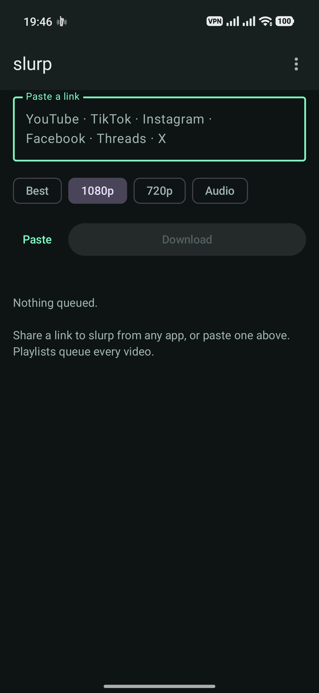

<p align="center">
  
</p>

# slurp

Paste a link, get the file. Android.

Handles YouTube, TikTok, Instagram, Facebook, Threads and X, plus the ~1800
other sites yt-dlp knows. Playlists queue every video in them.

The intended gesture is not pasting at all — it is **Share → slurp** from
inside whichever app you are already in. The link is queued before the share
sheet has finished closing.

<p align="center">
  
</p>

---

## Install

[**Latest release**](https://github.com/Javieboy/slurp/releases/latest) →
take **`slurp-arm64-v8a-recommended.apk`**. It fits any phone from roughly 2018
on. If it refuses to install, that phone is 32-bit — take
`slurp-universal-fallback.apk` instead, which works on any CPU at twice the
size.

Needs Android 10 or newer. slurp is not on the Play Store, so Android will warn
about installing from an unknown source; allow it when prompted. After that,
**Update app** in the overflow menu handles every release on its own.

No account, no sign-in, no server. slurp holds no credentials of any kind and
asks for five permissions, all of them about downloading and notifying. That is
also why sites needing a login do not work — see [Known limits](#known-limits).

---

## How it works

yt-dlp does the extraction. It is bundled inside the APK along with a Python
runtime, via [youtubedl-android](https://github.com/JunkFood02/youtubedl-android)
0.18.1, so there is no server and nothing to host.

That choice is the whole architecture, and it was made for one reason:
**extractors break constantly.** Sites change their players and yt-dlp ships a
fix within days. The alternatives both fail here — hand-written extractors mean
six things breaking on six independent schedules, and a self-hosted backend
means paying for a box and pushing every byte through it twice. Bundling yt-dlp
means **Update engine** in the overflow menu fetches a newer extractor at runtime
and fixes a broken site without shipping a new APK. Reach for it first when
something stops working.

| Piece | File |
|---|---|
| Pull a URL out of share-sheet noise | `core/UrlSniffer.kt` |
| Site badge | `core/Site.kt` |
| yt-dlp wrapper — probe, download, engine update | `engine/Ytdlp.kt` |
| Quality → yt-dlp format selectors | `engine/FormatPolicy.kt` |
| Queue, retries, stale-extractor recovery | `download/DownloadQueue.kt` |
| Keeping the queue across process death | `download/QueueStore.kt` |
| Staying alive in the background | `download/DownloadService.kt` |
| Landing files in the gallery | `download/MediaStoreSink.kt` |
| Updating the app itself, from `releases.atom` | `update/AppUpdater.kt` |
| Settings, and where downloads land | `ui/SettingsDialog.kt`, `data/Prefs.kt` |
| Play, and the best-effort Folder button | `ui/OpenFile.kt` |
| Job-card posters | `ui/Thumbnails.kt` |
| UI | `ui/HomeScreen.kt` |

A download is two steps. First a **probe** (`--dump-single-json
--flat-playlist`) asks yt-dlp what the link actually is; a playlist expands into
one job per video right there. Then each job downloads into its own empty
directory and whatever file appears is copied through MediaStore into
`Movies/slurp` for video and `Music/slurp` for audio — the folder name, and
whether video goes to Movies, DCIM or Download, are configurable in Settings.

The empty-directory trick is deliberate. Reconstructing yt-dlp's output path in
Kotlin is guesswork — extensions change after a merge, titles get sanitised
differently per platform, and `--extract-audio` renames the file afterwards.
Looking in an empty directory is exact.

---

## Things that will bite you

**Downloads run one at a time.** Not a simplification. Every one of these sites
rate-limits hard, and three parallel Instagram downloads earn a temporary block
that looks, from inside the app, exactly like a broken extractor.

**`--no-playlist` belongs on the probe, not just the download.** A YouTube link
shared while watching from a playlist or an autoplay Mix carries both `v=` and
`list=`. `download()` has always passed the flag, but that is too late: the
probe is what expands a playlist into jobs, and it ran without it. Measured
against a real shared link — `_type: playlist`, **279 entries**, so 279 queued
jobs draining one at a time through a queue that does not survive the app being
killed.

`UrlSniffer.namesOneVideoInsideAPlaylist` now decides at probe time. A bare
`/playlist?list=…` still expands, which is verified, and so is the 279 case
collapsing to 1.

**`height<=?1080`, not `height<=1080`.** The `?` makes the constraint advisory.
Plain `<=` fails the entire selector when a site reports no height, which is the
normal case for TikTok, Threads and most of X.

**Native libs must be extracted to disk at install time.**
`jniLibs.useLegacyPackaging = true` in `app/build.gradle.kts`. The Python
runtime has to exist as real files on the filesystem — it cannot be read out of
the APK — and legacy packaging is what puts it there, by setting
`android:extractNativeLibs=true` in the merged manifest. Turn it off and you get
a build that installs fine and dies on the first request.

Note that this means the `.so` entries inside the APK *are* DEFLATE-compressed;
`unzip -v` shows `Defl:N` for `libpython.so` and friends, and that is correct.
Uncompressed-in-the-APK is the opposite setting (`useLegacyPackaging = false`),
which loads libraries directly from the APK without ever writing them to disk
and is exactly the configuration that breaks the runtime. Check the flag, not
the compression:

```
aapt2 dump xmltree --file AndroidManifest.xml <apk> | grep extractNativeLibs
```

Do *not* add `android.bundle.enableUncompressedNativeLibs` to
`gradle.properties` to "help". AGP removed it in 8.1 and now fails the build
outright if it is present; its old behaviour is the default anyway.

### Releasing

**Cutting a release is pushing a tag.** `.github/workflows/release.yml` builds,
signs, verifies and publishes; the tag has to match `versionName` in
`app/build.gradle.kts` or it fails early.

```
git tag v1.4.0 && git push origin v1.4.0
```

**Or, with no git client: Actions → release → Run workflow**, and type the tag.
Same job, same gates — the version check still refuses a tag that disagrees
with `versionName`, and `gh release create --target "$GITHUB_SHA"` creates the
tag on the commit the run actually built. This exists because "any machine can
ship an update" quietly assumed a machine with git on it, and slurp gets
developed from a phone as often as not. A browser is enough.

Note the two doors differ in *what gets tagged*. A tag push releases whatever
you tagged; a dispatch releases the head of the branch you dispatch from, and
tags that. Dispatch from `main` and make sure `main` is what you mean to ship.

It publishes `slurp-arm64-v8a-recommended.apk` and `slurp-universal-fallback.apk`.
Those exact names matter: `AppUpdater` derives its download URL from them, device
ABI first and universal as the fallback. It also still recognises the older
`app-*-release.apk` scheme, which is what releases up to v1.2.0 used.

One-time setup. Make a key, keep it somewhere you will still have in five
years, and give it to Actions:

```
keytool -genkeypair -v -keystore slurp-release.jks -alias slurp \
  -keyalg RSA -keysize 4096 -validity 10000
base64 -w0 slurp-release.jks     # paste into the SIGNING_KEYSTORE_BASE64 secret
```

A phone is enough for all of this — no laptop required. In Termux:

```
pkg install openjdk-17 git termux-api
keytool -genkeypair -v -keystore slurp-release.jks -alias slurp \
  -keyalg RSA -keysize 4096 -validity 10000
base64 -w0 slurp-release.jks | termux-clipboard-set   # now paste it into the secret
```

Move the `.jks` somewhere that survives Termux being uninstalled — the app's
private storage does not. `termux-setup-storage` then a copy into
`~/storage/shared` is the usual route.

Three repository secrets, under Settings → Secrets and variables → Actions:
`SIGNING_KEYSTORE_BASE64`, `SIGNING_STORE_PASSWORD` and `SIGNING_KEY_ALIAS`.
`SIGNING_KEY_PASSWORD` is optional and falls back to the store password, which
is what keytool uses when you press Enter at its key-password prompt; set it
only for a key that genuinely has its own.

A GitHub secret is **not a backup** — they are write-only and cannot be read
back out. Keep your own copy of the `.jks`.

Local `assembleRelease` still falls back to this machine's debug key when
neither the env vars nor a `keystore.properties` resolve, which keeps
build-and-sideload working for your own testing. CI never publishes such a
build: the workflow inspects what came out and refuses anything signed
`CN=Android Debug`, because AGP falls back silently rather than failing, and a
debug-signed release would be rejected as an update by every existing install.

**Moving off the debug key costs exactly one uninstall, once.** Releases up to
v1.2.0 were signed with a laptop's debug key. Android only accepts an update
signed with the same key as the install, so the first real-key release has to be
uninstalled and reinstalled by hand. Every release after it updates normally,
from any machine — which is the point of moving.

**Two different things are called "update", and confusing them wastes time.**

| Menu item | What it replaces | Fixes |
|---|---|---|
| **Update engine** | the bundled yt-dlp, inside the existing install | a site that stopped working |
| **Update app** | the APK itself | anything in slurp's own code |

Engine update is the one to reach for when a site breaks — it lands in seconds
and needs no release. App update ships new code and costs an 80 MB download.
Neither can do the other's job, which is why both exist.

**The update check reads `releases.atom`, not the API.** Unauthenticated
`api.github.com` allows 60 requests an hour **per IP**, and an ISP that NATs its
customers shares one address between thousands of them, so a check can return
403 on a phone that has never called GitHub itself. nyaarank measured this
directly — `/rate_limit` reporting 0 of 60 remaining for an address that had
made no requests of its own — and the fix is ported from there. The atom feed is
served by the web host under no such quota.

The per-ABI splits mean the asset name depends on the device, so the derived URL
is HEAD-checked before use and falls back to `slurp-universal-fallback.apk`. **Do
not rename the release assets** without changing `AppUpdater.resolveApkUrl`; a
rename degrades to the universal APK rather than handing the installer a 404
page, but only because of that guard.

**Minification is off for release.** The library reaches into bundled Python by
name, R8 cannot see those references, and a minified build fails at runtime
rather than at compile time.

**The APK is large.** ~180 MB universal, roughly a third of that per ABI split,
because a Python runtime ships per architecture. Install the `arm64-v8a` split
on any phone from the last several years.

**minSdk is 29.** MediaStore's `RELATIVE_PATH` and `IS_PENDING` are API 29.
Supporting 26–28 means a second legacy write path plus `WRITE_EXTERNAL_STORAGE`.

**No `ACTION_VIEW` intent filter.** Adding one would make slurp a candidate
every time a link is tapped anywhere on the phone. Share is the explicit
gesture; keep it that way.

---

## Building

```
./gradlew assembleDebug
```

Needs JDK 17+ and an Android SDK with API 36 installed. This is for working on
slurp — if you just want the app, take a [release](#install) instead. Output
lands in `app/build/outputs/apk/debug/`:

| APK | Size |
|---|---|
| `app-arm64-v8a-debug.apk` | 90 MB ← the one to sideload while developing |
| `app-armeabi-v7a-debug.apk` | 83 MB |
| `app-x86_64-debug.apk` | 93 MB |
| `app-universal-debug.apk` | 191 MB |

A debug build is signed with your machine's debug key, so it will not install
over a release-signed slurp. Uninstall first, or use a separate device.

### Do not "update" the toolchain

The versions in `gradle/libs.versions.toml` are a matched set, not a snapshot of
what was newest. Picking the latest of each independently does not build:

- Compose BOM 2026.08 pins Compose 1.12, which **requires AGP 9.1+ and
  compileSdk 37**.
- AGP 9.x requires Gradle 9.5+, and folds Kotlin support in — it *rejects* the
  `org.jetbrains.kotlin.android` plugin outright, which is a real migration.
- `lifecycle` 2.11.0 also demands compileSdk 37.

So the stack is pinned to the last coherent AGP 8 set: **AGP 8.13.2 / Gradle
8.14.3 / compileSdk 36 / Compose BOM 2026.02.01 (Compose 1.10.4, Material3
1.4.0) / lifecycle 2.10.0**. Moving any one of these forward means moving all of
them, and doing the AGP 9 Kotlin-plugin migration at the same time.

Also: `material3` no longer brings the icons in transitively, so
`material-icons-core` is declared explicitly. The BOM pins it at 1.7.8, which is
where Google froze that artifact.

---

## Status

**Builds and ships.** `./gradlew assembleRelease` is green, `UrlSniffer` and
`Prefs.sanitiseFolder` have unit tests, and v1.3.1 was built, signed and
published by CI from a pushed tag. The published APK was downloaded back off the
release and its certificate checked, so the signing path is confirmed end to end
rather than assumed. `versionName` is now 1.4.3.

**Runs, and downloads.** Confirmed on a real phone across several sessions:
engine init and the Python unpack from the APK, probe, format selection,
download, the ffmpeg post-process to m4a, and the MediaStore write. Facebook and
YouTube both work, video and audio-only. Finished cards show Play and Folder.

Two predictions in this file were wrong and are worth recording. The JSON field
names in `model/Probe.kt` were called the most likely first failure; they were
fine. Facebook was expected to need cookies; it did not.

**On the VPN 403.** A YouTube download once failed with
`unable to download video data: HTTP Error 403: Forbidden` while the probe
succeeded — the title came back but the media fetch did not. The phone was on a
VPN, and the bundled yt-dlp was pulled out of the APK and run with the same
flags from a residential IP, where it downloaded fine. So the cause was the exit
IP, not the code. **It is not universal, though:** later downloads succeeded with
the VPN still on. It depends which exit address YouTube is willing to serve, so
treat a 403 as "try without the VPN", not as proof the VPN is always fatal.
`Ytdlp.hintFor` says exactly that on the card.

Still unexercised: the **share-sheet path** — every test link so far has been
pasted, and sharing is the app's headline gesture — plus playlists end to end,
cancel and retry, the automatic stale-extractor recovery (which needs a genuinely
broken site to trigger), and **Update app** performing a real in-place install.

**The 1.4.0 features were never exercised either, and one of them did not work.**
A read-through after the fact found that `DownloadQueue.runJob` never initialised
the engine. Only the probe did, and a queue restored from disk goes straight to
the pump without probing — so it raced the Python unpack that
`SlurpApp.onCreate` kicks off in parallel, lost, and every restored job failed
instantly with `instance not initialized`. Restored jobs also drained with no
foreground service, because `attach()` runs from `Application.onCreate` where
starting one is not allowed. Both are fixed; neither has run on a device. That
the persistent queue could ship and be released without once being restored is
the thing worth remembering here.

---

## Scope

For media you have a right to keep — your own uploads, things published for
download, material you have permission to archive. slurp does not touch DRM
and cannot download from subscription streaming services.

---

## Known limits

The things a new user hits first, collected so nobody has to read the whole
file to find them.

- **No cookie import**, so anything needing a login fails — private Instagram
  and most of Facebook. The single biggest functional gap.
- **The queue survives being killed, but a job caught mid-save does not
  resume by itself.** Everything queued is written to disk and picked back up
  next launch. The one exception is a download killed during the MediaStore
  write — there is no way to tell from the outside whether the file landed, so
  that job stops and asks, rather than risking a second copy in your gallery.
- **Downloads run one at a time**, deliberately: these sites rate-limit hard
  and parallel requests earn a block that looks like a broken extractor.
- **A VPN can cause `HTTP Error 403` on YouTube.** The site serves the page to
  anyone but refuses the media to exit IPs it dislikes, so the probe succeeds
  and the download fails. It depends on the exit address — plenty of VPN
  downloads work fine. If you hit a 403, try without it. slurp says so on the
  card.
- **The APK is large**, because a Python runtime ships inside it.

---

## License

GPLv3 — see `LICENSE`.

Not a free choice. `youtubedl-android` declares GPL-3.0 in its published POM,
and slurp links it and ships its ffmpeg build inside the APK, so everything
downstream is GPLv3 as well.

One consequence that outlives the licence file: distributing a binary owes the
*corresponding source* for the bundled components, not only for slurp's own
code. Publishing from this repo covers slurp; release notes need to link
upstream for youtubedl-android, yt-dlp, ffmpeg and aria2c.

---

## Ideas

- **Cookie import**, for links that need a login. The single biggest functional
  gap — private Instagram and most of Facebook cannot work without it. Note it
  changes slurp's security posture: `Prefs` currently holds nothing secret, and
  that would stop being true.
- Check the *engine* for updates on a schedule. The app already checks itself
  once a day at launch, silently (`AppUpdater.checkOnLaunch`); yt-dlp is still
  only updated on demand, or by the queue's automatic recovery after a failure
  that looks like a stale extractor.
- A real download history, with a cap and a way to browse it. Finished jobs
  currently persist as queue entries — `QueueStore` keeps the last 50 so the
  file cannot grow forever — which is a side effect of the queue rather than a
  feature anyone designed.
- Run downloads from *different* sites in parallel. The one-at-a-time rule is
  about per-host rate limiting, so it does not need to be global.
- Subtitle download for YouTube.
